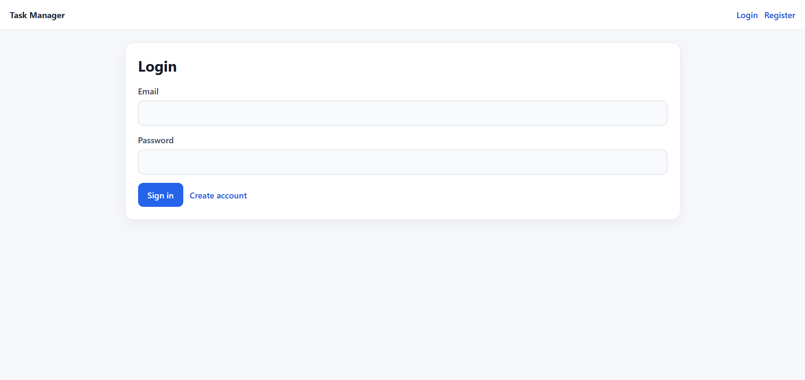
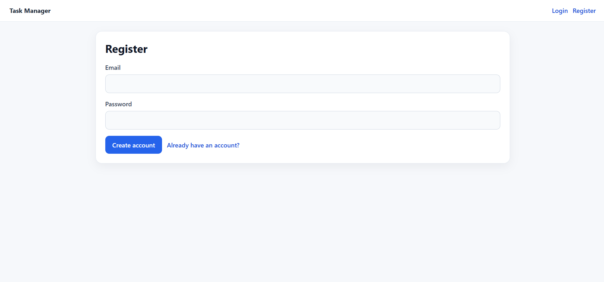
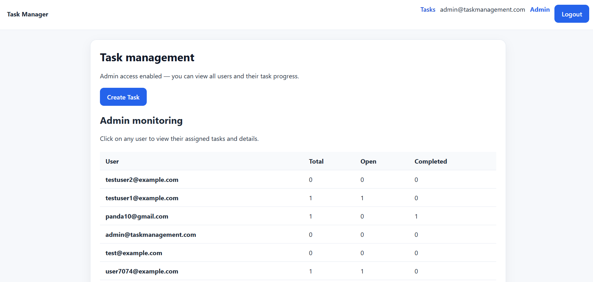
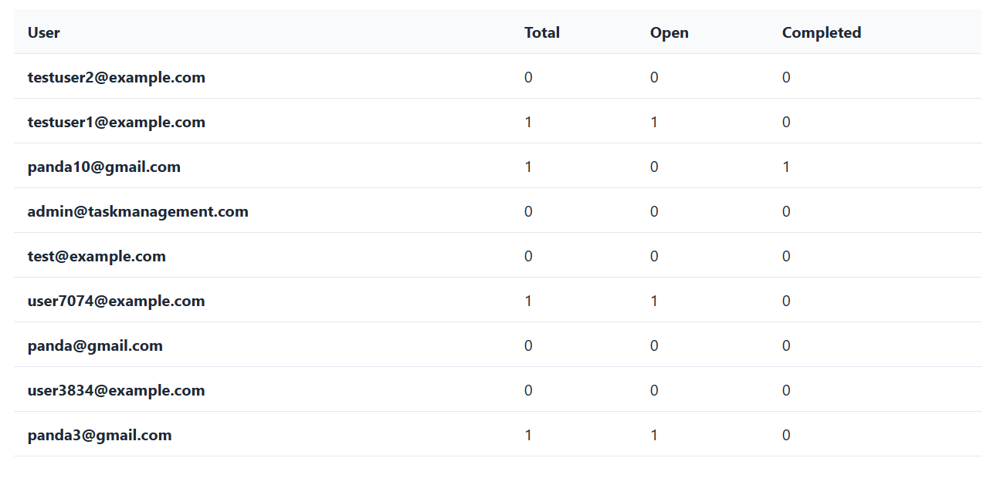
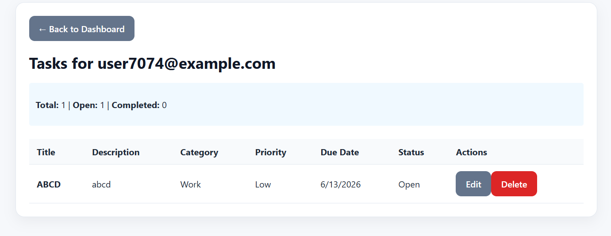
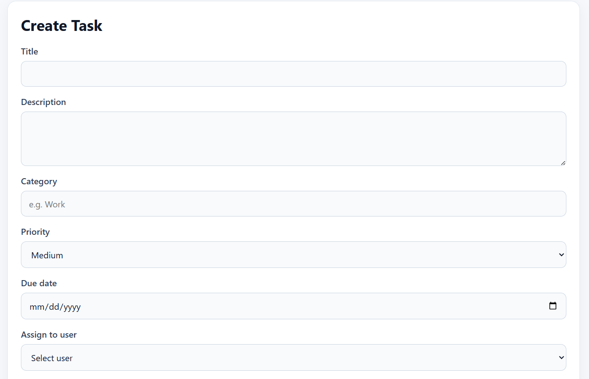
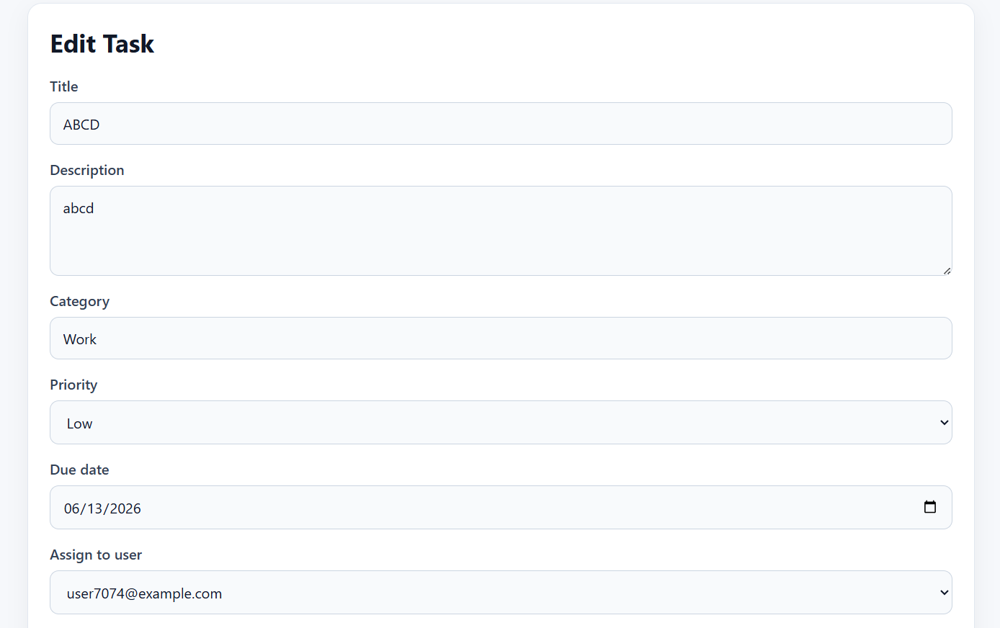

# Task Management Tool

A modern full-stack task management application built with **ASP.NET Core 8**, **React**, **Vite**, and **SQL Server**. Features role-based access control (Admin & User roles), task creation/assignment, user progress monitoring, and JWT-based authentication.

## 📋 Table of Contents

- [Features](#features)
- [Tech Stack](#tech-stack)
- [Project Structure](#project-structure)
- [Getting Started](#getting-started)
- [Database Setup](#database-setup)
- [Running the Application](#running-the-application)
- [API Documentation](#api-documentation)
- [Screenshots](#screenshots)
- [Default Credentials](#default-credentials)
- [Project Architecture](#project-architecture)
- [Troubleshooting](#troubleshooting)

---

## ✨ Features

### User Features
- ✅ User registration and login with JWT authentication
- ✅ Create, edit, and delete personal tasks
- ✅ Categorize tasks (Work, Personal, Bug, etc.)
- ✅ Set task priority (Low, Medium, High)
- ✅ Mark tasks as complete/incomplete
- ✅ Set task due dates

### Admin Features
- ✅ Admin dashboard with user monitoring
- ✅ View all users and their task progress (total, open, completed)
- ✅ Create and assign tasks to any user
- ✅ View detailed task list for each user
- ✅ Edit and delete user tasks
- ✅ Filter and search user task progress

### Authentication & Security
- ✅ JWT-based token authentication
- ✅ Role-based access control (Admin/User)
- ✅ Secure password hashing with Identity
- ✅ CORS configured for frontend-backend communication
- ✅ Swagger API documentation

---

## 🛠️ Tech Stack

### Backend
- **Framework**: ASP.NET Core 8
- **Database**: SQL Server (LocalDB)
- **ORM**: Entity Framework Core
- **Authentication**: JWT Bearer + Identity
- **SonarQube**: Code quality and security analysis
- **Logging**: Serilog 
- **Testing**: xUnit for unit tests 
- **Git**: Version control with Git and GitHub

### Frontend
- **Framework**: React 18
- **Build Tool**: Vite
- **Routing**: React Router v6
- **Styling**: CSS (custom)
- **HTTP Client**: Fetch API

### Database
- **Type**: SQL Server LocalDB
- **Migrations**: EF Core migrations
- **Tables**: AspNetUsers, AspNetRoles, Tasks, Categories, TaskComments

---

## 📁 Project Structure

```
Task Management Tool/
├── src/
│   ├── TaskManagement.Api/               # Backend (ASP.NET Core)
│   │   ├── Controllers/
│   │   │   ├── AuthController.cs         # Login, Register endpoints
│   │   │   ├── TasksController.cs        # Task CRUD operations
│   │   │   └── UsersController.cs        # Admin user monitoring
│   │   ├── Data/
│   │   │   └── ApplicationDbContext.cs   # EF Core DbContext
│   │   ├── Models/
│   │   │   ├── TaskItem.cs
│   │   │   ├── Category.cs
│   │   │   ├── TaskComment.cs
│   │   │   ├── AppUser.cs                # Identity user extension
│   │   │   └── AuthModels.cs             # DTOs
│   │   ├── Migrations/                   # EF Core migrations
│   │   ├── Program.cs                    # App configuration & seeding
│   │   └── appsettings.json              # Connection string & config
│   │
│   └── client/                           # Frontend (React + Vite)
│       ├── src/
│       │   ├── pages/
│       │   │   ├── LoginPage.jsx
│       │   │   ├── RegisterPage.jsx
│       │   │   ├── TaskDashboard.jsx     # Main admin dashboard
│       │   │   ├── TaskCreation.jsx      # Task creation screen
│       │   │   └── UserTaskDetail.jsx    # User task detail screen
│       │   ├── components/
│       │   │   └── Navigation.jsx
│       │   ├── services/
│       │   │   ├── api.js                # API client
│       │   │   └── authStorage.js        # Auth token management
│       │   ├── App.jsx
│       │   ├── App.css
│       │   └── main.jsx
│       └── vite.config.js
│
├── .github/
│   └── [Screenshots folder - see Screenshots section]
│
└── README.md
```

---

## 🚀 Getting Started

### Prerequisites

- **.NET 8 SDK**: [Download](https://dotnet.microsoft.com/download/dotnet/8.0)
- **Node.js 16+**: [Download](https://nodejs.org/)
- **SQL Server LocalDB**: Included with Visual Studio or [Download](https://learn.microsoft.com/en-us/sql/database-engine/configure-windows/sql-server-express-localdb)
- **Git**: [Download](https://git-scm.com/)

### Clone Repository

```bash
git clone https://github.com/yourusername/Task-Management-Tool.git
cd Task\ Management\ Tool
```

---

## 💾 Database Setup

### Step 1: Update Connection String (if needed)

Edit `src/TaskManagement.Api/appsettings.json`:

```json
{
  "ConnectionStrings": {
    "DefaultConnection": "Server=(localdb)\\mssqllocaldb;Database=TaskManagementDb;Trusted_Connection=true;"
  }
}
```

### Step 2: Apply Migrations

```bash
cd src/TaskManagement.Api
dotnet ef database update
```

This will:
- Create the SQL Server database `TaskManagementDb`
- Create all required tables
- Seed Admin and User roles
- Seed default admin account: `admin@taskmanagement.com` / `Admin123!`

### Step 3: Verify Database

Open SQL Server Management Studio (SSMS) or Azure Data Studio and connect to `(localdb)\mssqllocaldb`:

```sql
SELECT * FROM AspNetRoles;                    -- Verify roles
SELECT * FROM AspNetUsers;                    -- Verify admin user
SELECT * FROM Tasks;                          -- View tasks
SELECT * FROM Categories;                     -- View categories
```

---

## ▶️ Running the Application

### Terminal 1: Start Backend API

```bash
cd src/TaskManagement.Api
dotnet run
```

**Expected Output:**
```
Now listening on: http://localhost:5101
Application started. Press Ctrl+C to shut down.
```

### Terminal 2: Start Frontend Dev Server

```bash
npm run dev --prefix client
```

**Expected Output:**
```
VITE v4.5.14  ready in XXX ms

➜  Local:   http://localhost:5173/
```

### Access Application

Open your browser and navigate to:

```
http://localhost:5173
```

---

## 📡 API Documentation

All endpoints are documented in Swagger at: `http://localhost:5101/swagger/index.html`

### Authentication Endpoints

#### Register User
```http
POST /api/auth/register
Content-Type: application/json

{
  "email": "user@example.com",
  "password": "Password123!",
  "displayName": "John Doe"
}

Response (201):
{
  "token": "eyJhbGciOiJIUzI1NiIs...",
  "email": "user@example.com",
  "role": "User"
}
```

#### Login
```http
POST /api/auth/login
Content-Type: application/json

{
  "email": "admin@taskmanagement.com",
  "password": "Admin123!"
}

Response (200):
{
  "token": "eyJhbGciOiJIUzI1NiIs...",
  "email": "admin@taskmanagement.com",
  "role": "Admin"
}
```

### Task Endpoints

#### Get All Tasks (User sees own, Admin sees all)
```http
GET /api/tasks
Authorization: Bearer {token}

Response (200):
[
  {
    "id": 1,
    "title": "Complete project",
    "description": "Finish the task management tool",
    "dueDate": "2026-06-30T00:00:00",
    "isComplete": false,
    "priority": "High",
    "category": "Work",
    "ownerId": "user-uuid",
    "ownerEmail": "user@example.com"
  }
]
```

#### Create Task
```http
POST /api/tasks
Authorization: Bearer {token}
Content-Type: application/json

{
  "title": "New Task",
  "description": "Task description",
  "dueDate": "2026-06-30",
  "isComplete": false,
  "priority": "Medium",
  "category": "Work",
  "ownerId": null  // Admin can assign to specific user
}

Response (201):
{
  "id": 5,
  "title": "New Task",
  ...
}
```

#### Update Task
```http
PUT /api/tasks/{id}
Authorization: Bearer {token}
Content-Type: application/json

{
  "title": "Updated Title",
  "isComplete": true,
  ...
}

Response (204): No Content
```

#### Delete Task
```http
DELETE /api/tasks/{id}
Authorization: Bearer {token}

Response (204): No Content
```

### Admin Endpoints

#### Get All Users
```http
GET /api/users
Authorization: Bearer {admin-token}

Response (200):
[
  {
    "id": "user-uuid",
    "email": "admin@taskmanagement.com"
  }
]
```

#### Get User Progress (Total, Open, Completed Tasks)
```http
GET /api/users/progress
Authorization: Bearer {admin-token}

Response (200):
[
  {
    "id": "user-uuid",
    "email": "user@example.com",
    "totalTasks": 10,
    "completedTasks": 6,
    "openTasks": 4
  }
]
```

---

## 📸 Screenshots

#### 1. **Login Screen**


Users can log in with email and password. New users can register by clicking the "Register" link.

---

#### 2. **Register Screen** 


New users can create an account by providing email, password, and display name.

---

#### 3. **Admin Dashboard** 


The admin dashboard displays the overall task management interface with quick access to create tasks.

---

#### 4. **User Progress Table** 


Admins can see all users and their task statistics at a glance. Click any user row to view their detailed task list.

---

#### 5. **User Task Detail Screen** 


Clicking on a user from the dashboard opens their detailed task view. Admins can edit or delete individual tasks here.

---

#### 6. **Task Creation Screen** 


Users can create new tasks with title, description, category, priority, and due date. Admins can assign tasks to specific users.

---

#### 7. **Task Edit Screen** 


Existing tasks can be edited from the user task detail screen. All fields are pre-populated with current task data.

---

## 🔐 Default Credentials

### Admin Account (Pre-seeded)

| Field | Value |
|-------|-------|
| Email | `admin@taskmanagement.com` |
| Password | `Admin123!` |
| Role | Admin |

### Create Test User

1. Go to `http://localhost:5173/register`
2. Register with test credentials:
   - Email: `testuser@example.com`
   - Password: `TestUser123!`
   - Display Name: Test User

---

## 🏗️ Project Architecture

### Authentication Flow

```
User Input (Login/Register)
        ↓
React Component (LoginPage/RegisterPage)
        ↓
API Request (POST /api/auth/login or /api/auth/register)
        ↓
Backend (AuthController)
        ↓
Identity (Password validation, User creation)
        ↓
JWT Token Generation
        ↓
Token stored in localStorage (frontend)
        ↓
Authorization header for subsequent requests
```

### Task Management Flow

```
Dashboard (Admin/User)
        ↓
Task Creation Screen ← OR → Task Detail Screen
        ↓
API Request (Create/Update/Delete)
        ↓
Backend (TasksController)
        ↓
EF Core (Database operations)
        ↓
Response back to UI
        ↓
Dashboard refresh with updated data
```

### Database Schema

```
AspNetUsers (Identity)
├── Id (PK)
├── Email
├── NormalizedEmail
├── PasswordHash
├── SecurityStamp
└── (other Identity fields)

AspNetRoles (Identity)
├── Id (PK)
├── Name (Admin, User)
└── NormalizedName

AspNetUserRoles (Identity Junction)
├── UserId (FK → AspNetUsers)
└── RoleId (FK → AspNetRoles)

Tasks
├── Id (PK)
├── Title
├── Description
├── Priority
├── IsComplete
├── CreatedAt
├── UpdatedAt
├── OwnerId (FK → AspNetUsers)
├── CategoryId (FK → Categories, nullable)
└── DueDate (nullable)

Categories
├── Id (PK)
├── Name
└── Description

TaskComments
├── Id (PK)
├── Body
├── AuthorId (FK → AspNetUsers)
├── TaskId (FK → Tasks)
└── CreatedAt
```

---

## 🐛 Troubleshooting

### Issue: "Database connection failed"

**Solution:**
```bash
# Verify SQL Server LocalDB is running
sqllocaldb start mssqllocaldb

# Check connection string in appsettings.json
# Update if needed with correct LocalDB instance name
```

### Issue: "Port 5173 already in use"

**Solution:**
```bash
# Frontend will auto-increment to 5174, 5175, etc.
# OR kill the process on port 5173:

# Windows (PowerShell):
Get-Process | Where-Object {$_.Port -eq 5173} | Stop-Process -Force

# macOS/Linux:
lsof -ti:5173 | xargs kill -9
```

### Issue: "API not responding" / "CORS error"

**Solution:**
- Ensure backend is running: `http://localhost:5101`
- Check browser Console (F12) for exact error
- Verify CORS is enabled in `Program.cs`:
  ```csharp
  builder.Services.AddCors(options =>
  {
      options.AddPolicy("AllowLocalhost", policy =>
      {
          policy.WithOrigins("http://localhost:5173", "http://localhost:5174", "http://localhost:5175")
                .AllowAnyMethod()
                .AllowAnyHeader();
      });
  });
  ```

### Issue: "Blank screen on app load"

**Solution:**
1. Open browser DevTools (F12) → Console tab
2. Look for red error messages
3. Common causes:
   - Missing import in component
   - API call failing
   - localStorage issues (clear with `localStorage.clear()`)

### Issue: "404 - User not found" when viewing user tasks

**Solution:**
- Ensure user exists in database
- Check that userId in URL matches database UserId
- Verify admin token is valid (check Console Network tab)

---

## 📝 Development Notes

### Useful Commands

```bash
# Backend

# Run with hot reload
dotnet watch run --project src/TaskManagement.Api

# Create new migration
dotnet ef migrations add MigrationName --project src/TaskManagement.Api

# Apply migrations
dotnet ef database update --project src/TaskManagement.Api

# View database
sqlcmd -S (localdb)\mssqllocaldb

# Frontend

# Install dependencies
npm install --prefix client

# Run dev server
npm run dev --prefix client

# Build for production
npm run build --prefix client

# Preview production build
npm run preview --prefix client
```

### Code Style & Best Practices

- **Backend**: Follow ASP.NET Core conventions
  - Controllers in `Controllers/` folder
  - Models in `Models/` folder
  - Data context in `Data/` folder
  - Use async/await for I/O operations

- **Frontend**: Follow React conventions
  - Components in `pages/` or `components/` folders
  - Services in `services/` folder
  - Use functional components and hooks
  - Keep components focused and reusable

---

## 📄 License

This project is licensed under the MIT License - see the LICENSE file for details.

---

## 🤝 Contributing

Contributions are welcome! Please follow these steps:

1. Fork the repository
2. Create a feature branch (`git checkout -b feature/AmazingFeature`)
3. Commit changes (`git commit -m 'Add AmazingFeature'`)
4. Push to branch (`git push origin feature/AmazingFeature`)
5. Open a Pull Request

---

## 📧 Contact & Support

For questions or issues:
- Open an issue on GitHub
- Check existing issues for solutions
- Review the Troubleshooting section above

---

## 🎯 Roadmap

### Future Enhancements
- [ ] Task filtering and sorting by status/priority
- [ ] Task search functionality
- [ ] Task comments and collaboration
- [ ] Email notifications for task assignments
- [ ] Task history and audit logs
- [ ] Advanced user permissions (Team Lead, Manager roles)
- [ ] Mobile app (React Native)
- [ ] Dark mode
- [ ] Calendar view for tasks
- [ ] Task analytics and reports

---

**Last Updated**: June 4, 2026  
**Version**: 1.0.0

## Author
Muhammad Farrukh Iqbal
